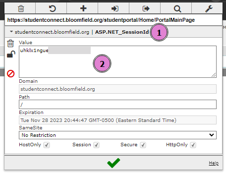
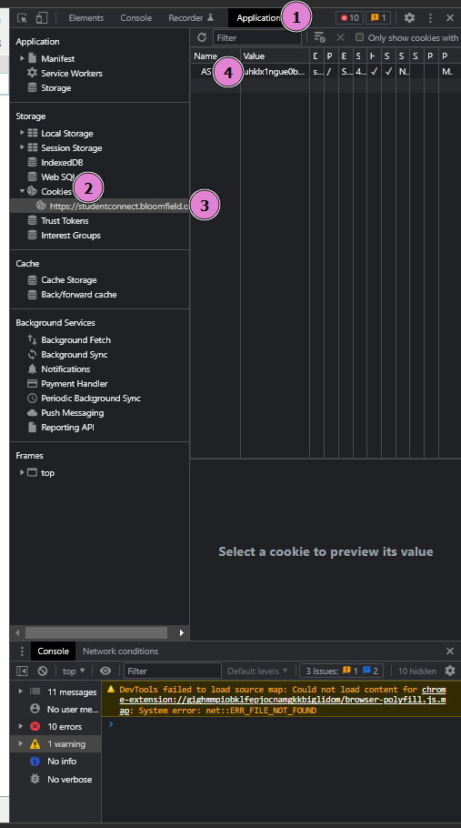

<h1 align="center">StudentConnect Abstraction API</h1>

### Important to know !

-   Currently this project is only supported for the Bloomfield domain (https://studentconnect.bloomfield.org/). I have provided a structure for easy future-modification to allow for support for other school districts (I can assume that the implementation of STC will be the same).
-   Some API routes are not fully finished; this is due to my lack of data for that specific route, so the implementation is either not there or implied by past implementations.
-   Not all the data is clean or properly formatted in the way that I would like; this service currently just scrapes the data and does minimal text-processing, much less than what I would like or need.
-   There is not a formal login yet, you need to use your session cookie.

### Installation
This project can be self-hosted or be used via our public server (*tk*).

Installation steps 
1. Clone the repository with your preferred method (make sure to use branch *api*)
2. Install the node dependencies via ``npm install``
3. Run the server development mode by running ``npm run dev``
4. Access the server at ``http://localhost:PORT`` with the PORT being set to a default of **3000**

### Request Structure
Since this api is designed to be a read-only api, all methods for the fetching will be done as a ``GET`` method.

All requests must have the ``sessioncookie`` header set to the ``ASP.NET_SessionId`` cookie value.

### Obtaining your ``ASP.NET_SessionID``
The process can either be done very simply through the use of the extension [EditThisCookie](https://chrome.google.com/webstore/detail/editthiscookie/fngmhnnpilhplaeedifhccceomclgfbg?hl=en) or via the ChromeDevTools and the application menu.

#### **EditThisCookie method**
1. Go to stc
2. Login to stc with your credentials 
3. Open EditThisCookie from the extension tool bar
4. Find the ``ASP.NET_SessionID`` and copy the **value** only!! \

#### **ChromeDevTools method**
1. Go to stc
2. Login to stc with your credentials
3. Open ChromeDevTools with whatever you have it bound to (typically CTRL+SHIFT+C or F12)
4. Navigate to the application tab
5. Find under the section **Storage**, **Cookies** and then the domain of your stc
6. Find the ``ASP.NET_SessionID`` and copy the **value** only!! \

### Response Structure
All data will be returned in a JSON format.